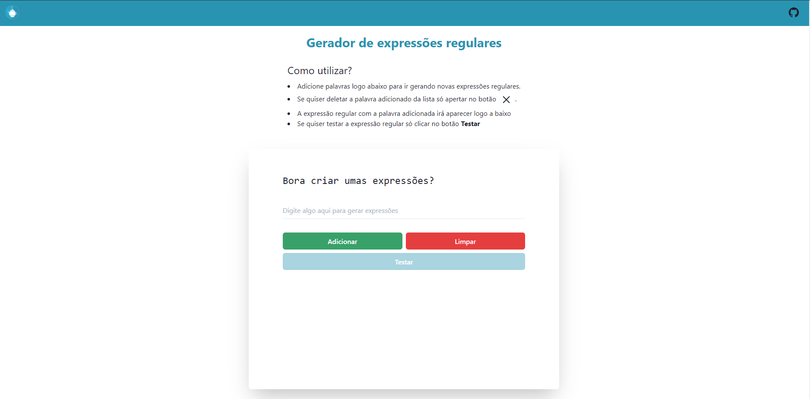
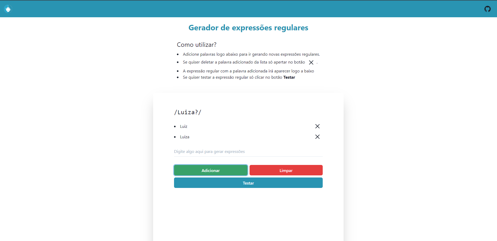
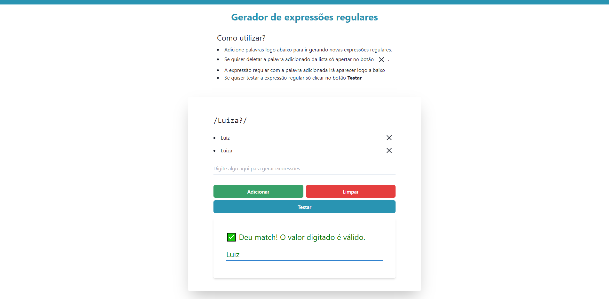
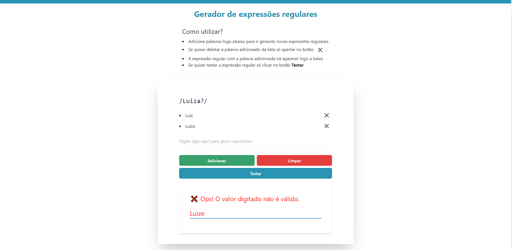

<p align="center">
   
</p>

<h1 align="center"> 🤖 Gerador de Expressões regulares - RegexBuilder</h1>

<p align="center">
	<a href="https://www.linkedin.com/in/luiz-gustavo-56146b1a5/">
      
   </a>
  

  
  <a href="https://github.com/tonicprism/regex-generator/#readme">
    
  </a>
   <a href="https://github.com/tonicprism/regex-generator/commits/master">
      
  </a>
   <a href="https://github.com/tonicprism/regex-generator/stargazers">
      
   </a>
</p>

> 🤖 O **Gerador de Expressões regulares** é uma aplicação web que gera e valida expressões regulares a partir do que o usuário digita.

<p align="center">
    <a href="README-pt.md">Português</a>
</p>

<div align="center">
  <sub>O projeto RegexBuilder. Foi construído com ❤︎ por
    <a href="https://github.com/tonicprism">Luiz Gustavo</a>
  </sub>
</div>

# :pushpin: Tabela de Conteúdo

- [O que são expressões regulares?](#o-que-são-expressões-regulares)
- [Tecnologias](#computer-tecnologias)
- [Como fazer o projeto funcionar na sua máquina](#construction_worker-how-to-run)

# 📸 Screenshots

<p align="center">
   
</p>
<p align="center">
   
</p>
<p align="center">
   
</p>
<p align="center">
   
</p>
<p align="center">
   
</p>

# O que são expressões regulares?

Em ciência da computação, uma expressão regular ou "Regex" (ou os estrangeirismos regex ou regexp, abreviação do inglês regular expression) provê uma forma concisa e flexível de identificar cadeias de caracteres de interesse, como caracteres particulares, palavras ou padrões de caracteres. Expressões regulares são escritas numa linguagem formal que pode ser interpretada por um processador de expressão regular, um programa que serve um gerador de analisador sintático ou examina o texto e identifica as partes que casam com a especificação dada.

## De onde vem o termo?

O termo deriva do trabalho do matemático norte-americano Stephen Cole Kleene, que desenvolveu as expressões regulares como uma notação ao que ele chamava de álgebra de conjuntos regulares. Seu trabalho serviu de base para os primeiros algoritmos computacionais de busca, e depois para algumas das mais antigas ferramentas de tratamento de texto da plataforma Unix.

## Onde se é utilizado?

O uso atual de expressões regulares inclui procura e substituição de texto em editores de texto e linguagens de programação, validação de formatos de texto (validação de protocolos ou formatos digitais), realce de sintaxe e filtragem de informação.

# :computer: Tecnologias

Este projeto foi feito utilizando as seguintes tecnologias:

- [React](https://pt-br.reactjs.org/)
- [NextJS](https://nextjs.org/)
- [Chakra-UI](https://chakra-ui.com/)
- [Regexgen](https://github.com/devongovett/regexgen)

# :construction_worker: Como fazer o projeto funcionar na sua máquina

Dê um Fork nesse repositório e clone na sua máquina. Dentro da página do projeto rode os seguintes comandos:

```sh
# Instale as dependências
$ yarn # ou npm install


# Rode a aplicação
$ yarn dev # ou npm run dev
```

Deixe uma ⭐️ se este projeto ajudou você!
